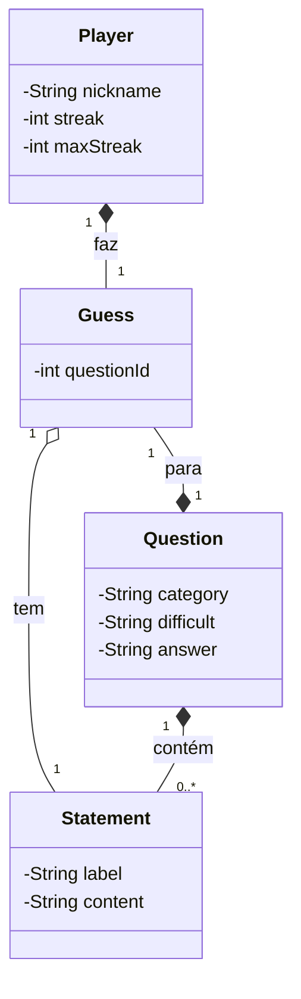

# API de Trivia

Esse é um projeto desenvolvido para o desafio da [DIO](https://web.dio.me/) da trilha de Java com Spring.

## Do que se trata?

A API em si permite a criação de perguntas de múltipla escolha para uma trivia/quiz. Também os palpites de um jogador e contabiliza quantas perguntas este acertou em sequência.

## Diagrama de Classes

Segue o diagrama de classes descrevendo como é a relação das classes propostas:

## Tecnologias usadas

- Java 21
- Framework Spring para criação do projeto
- OpenAPI/Swagger para documentação e teste dos *endpoints*
- Railway para CI/CD e deploy da aplicação

